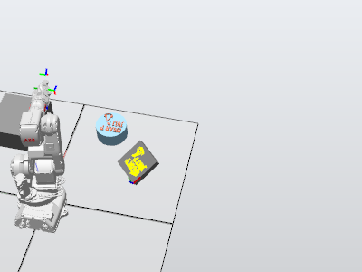

# Laboratorio 1 Robotica 2024-II
### Integrantes
#### Julian David Pulido Castañeda
#### Omar Armando Perez Ospino
## Descripcion de la solucion planteada
### Problematica
En la industria de alimentos, en especial panaderıa, quieren mejorar su proceso de produccion. Ellos consideran que la decoracion de las tortas puede ser un punto a ser ejecutado por robots. Se propone hacer la decoracion de una torta virtual. Es decir. 

Sobre una superficie plana bien sea redonda o rectangular, escribir 5 primeras letras de los nombres de cada uno de los integrantes del grupo y una decoracion a su gusto. En este caso se desea generar los paths o los movimientos de robot necesarios para representar las letras y la decoracion. 

Se deben tener en cuenta las siguientes restricciones:
* El tamaño de la torta es para 20 personas
* Las trayectorias a desarrollar deberan realizarse en un rango de velocidades entre 100 y 1000.
* La zona tolerable de errores maxima debe ser de z10.
* El movimiento debe partir de una posicion home especificada (puede ser el home del robot) y realizar la trayectoria de cada palabra y decoracion con un trazo continuo. El movimiento debe finalizar en la misma posicion de home en la que se inicio.
* La decoracion de la torta debe ser realizada sobre una papel. El papel puede ser fijado sobre una superficie horizontal o sobre una plano inclinado.
* Los nombres deben estar separados.

Ademas se deben icluir señales de entrada y salidas. Se deben crear dos entradas y dos salidas digitales configurandolas correctamente en el codigo de RAPID.
* La primera señal de entrada debe iniciar una rutina de decorado sobre cualquier superficie y encender una luz de indicacion. Al final de la rutina el brazo debe regresar a su posicion de HOME donde todos los angulos articulares son 0 grados.
* La segunda señal de entrada debe posicionar el brazo en una pose de mantenimiento donde se pueda instalar o desinstalar la herramienta y se indique el estado con la segunda luz.

## Diagrama de flujo de acciones del robot.
## Plano de planta de la ubicacion de cada uno de los elementos.
## Descripcion de las funciones utilizadas.
## Diseño de la herramienta.

  

## Codigo en RAPID del modulo utilizado para el desarrollo de la practica.
## Vıdeo que contenga la simulacion en RobotStudio ası como la implementacion de la practica con los robots reales.
