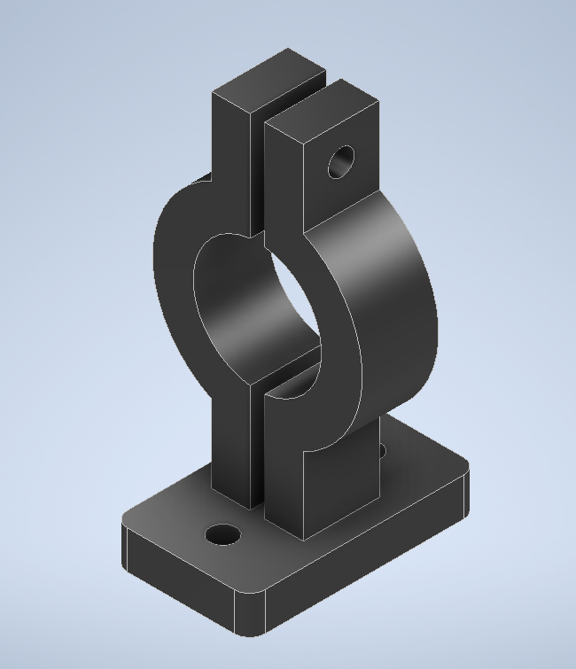
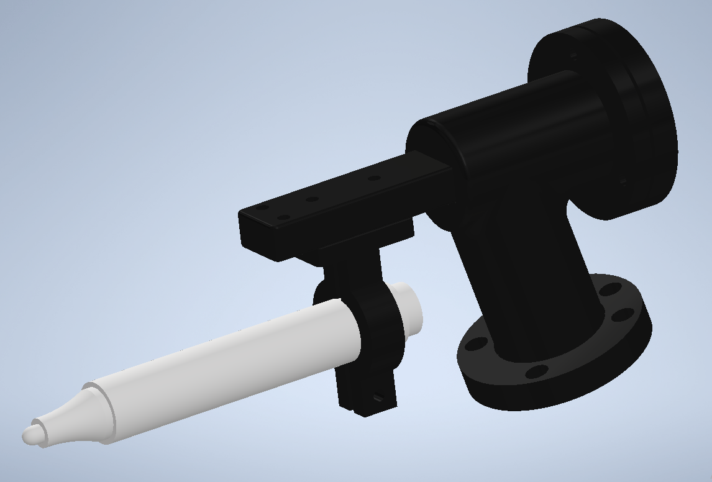
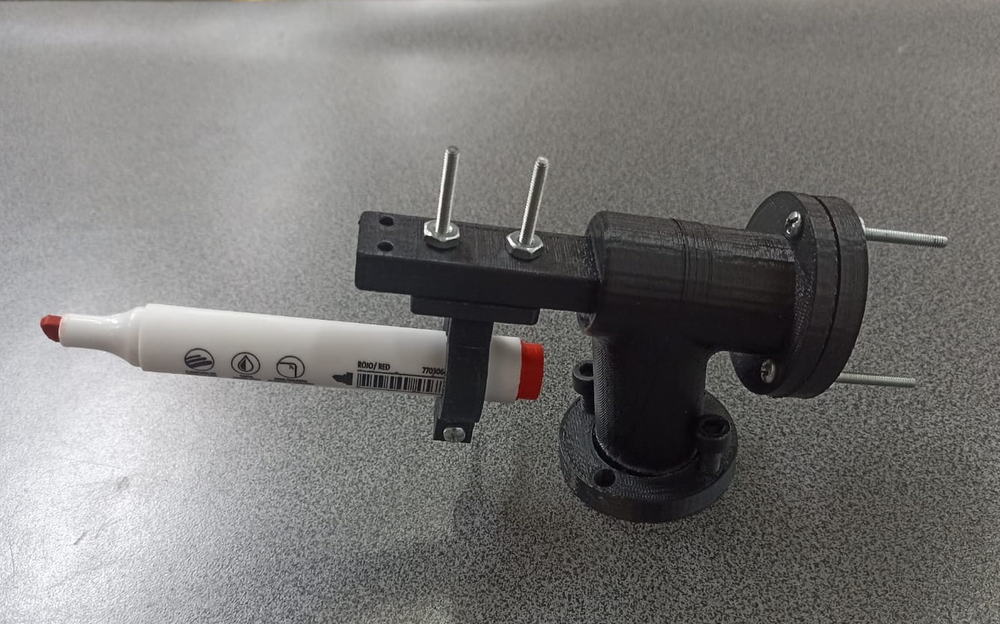

# Laboratorio 1 Robótica 2024-II
### Integrantes
#### Julian David Pulido Castañeda
#### Omar Armando Pérez Ospino
## Descripción de la solución planteada
### Problemática
En la industria de alimentos, en especial panadería, quieren mejorar su proceso de producción. Ellos consideran que el proceso de decoración de sus tortas puede ser ejecutado por robots. Se propone hacer la decoración de una torta virtual, es decir, sobre una superficie plana bien sea redonda o rectangular, escribir 5 primeras letras de los nombres de cada uno de los integrantes del grupo y una decoracion a su gusto. En este caso se desea generar los <i>paths</i> o los movimientos de robot necesarios para representar las letras y la decoración. 

Se deben tener en cuenta las siguientes restricciones:
<ul>
  <li>El tamaño de la torta es para 20 personas.</li>
  <li>Las trayectorias a desarrollar deberan realizarse en un rango de velocidades entre 100 y 1000.</li>
  <li>La zona tolerable de errores maxima debe ser de z10.</li>
  <li>El movimiento debe partir de una posición home especificada (puede ser el home del robot), realizar la trayectoria de cada palabra y decoración con un trazo continuo. El movimiento debe finalizar en la misma posicion de home en la que se inicio.</li>
  <li>La decoracion de la torta debe ser realizada sobre una papel. El papel puede ser fijado sobre una superficie horizontal o sobre una plano inclinado.</li>
  <li>Los nombres deben estar separados.</li>
  
</ul>

Además se deben incluir señales de entrada y salidas. Se deben crear dos entradas y dos salidas digitales configurándolas correctamente en el codigo de RAPID.

<ul>
  <li>La primera señal de entrada debe iniciar una rutina de decorado sobre cualquier superficie y encender una luz de indicacion. Al final de la rutina el brazo debe regresar a su posicion de HOME donde todos los angulos articulares son 0 grados.</li>
  <li>La segunda señal de entrada debe posicionar el brazo en una pose de mantenimiento donde se pueda instalar o desinstalar la herramienta y se indique el estado con la segunda luz.</li>
</ul>

## Diagrama de flujo de acciones del robot
## Plano de planta de la ubicación de cada uno de los elementos
## Descripción de las funciones utilizadas

<ul>
  <li><code>main()</code> Es la función principal del programa, llama a todas las funciones que realizan el movimiento del manipulador y contiene toda la lógica de la entradas y salidas digitales.
  <li><code>goHome()</code> Posee una sola instrucción tipo MoveAbsJ que envía todas las articulaciones del robot a cero.</li>
  <li><code>mantenimiento()</code> De manera similar a <code>goHome()</code>, esta función utiliza una instrucción MoveAbsJ para envíar las articulaciones del robot a una posición específica. En este caso envía las articulaciones 3 y 5 a las posiciones -30° y -50°, respectivamente.</li>
  <li><code>omarp()</code></li> Realiza la trayectoria que dibuja la secuencia de letras "omar p".
  <li><code>julip()</code></li> Realiza la trayectoria que dibuja la secuencia de letras "juli p".
  <li><code>logo()</code></li> Realiza la trayectoria que dibuja el logo diseñado.
</ul>

## Diseño de la herramienta
Para el diseño de la herramienta se buscó que fuese posible cambiar fácilmente el instrumento de escritura, que en este caso se trata de un marcador borrable, y que a su vez éste se encuentre correctamente firmemente agarrado a la herramienta. Para ello se ha diseñado una abrazadera (figura 1), que se ajusta a objetos cilíndricos de aproximadamente 16 mm, que es la medida del diámetro del tipo de marcador usado.

  
  
Figura 1. Abrazadera diseñada para sostener el elemento de escritura.

Adicionalmente, se ha diseñado en la herramienta una junta prismática de cuenta con un resorte para permitir un cierto grado de error en el posicionamiento del marcador. El resultado final de la herramienta diseñada se muestra en la figura 2.

  
  
Figura 2. Modelo CAD de la herramienta diseñada.

La fabricación de la herramienta diseñada se realizó con el método manufactura aditiva utilizando PLA. En la figura 3 se muestra la herramienta fabricada.

  
  
Figura 3. Foto de la herramienta fabricada en PLA por medio de manufactura aditiva.

Para hallar el TCP se utilizaron dos métodos: el primero fue utilizar el TCP calculado directamente mediante RobotStudio utilizando el modelo CAD y el segundo fue directamente en el FlexPendant mediante el método de definición TCP & Z. En la tabla 1 se muestra una comparación entre los resultados obtenidos mediante los dos métodos.

<table align="center">
  <tr>
    <th>TCP</th>
    <th>CAD</th>
    <th>Manual</th>
  </tr>
  <tr>
    <td>x</td>
    <td>148.954</td>
    <td>142.652</td>
  </tr>
  <tr>
    <td>y</td>
    <td>0</td>
    <td>37.0488</td>
  </tr>
  <tr>
    <td>z</td>
    <td>67.083</td>
    <td>68.0102</td>
  </tr>
  <tr>
    <td>q1</td>
    <td>0.793353</td>
    <td>0.94672</td>
  </tr>
  <tr>
    <td>q2</td>
    <td>0</td>
    <td>0.284099</td>
  </tr>
  <tr>
    <td>q3</td>
    <td>0.608761</td>
    <td>0.145287</td>
  </tr>
  <tr>
    <td>q4</td>
    <td>0</td>
    <td>0.0435988</td>
  </tr>
</table>

Tabla 1. Comparación de valores de TCP obtenidos por medio del modelo CAD y de manera manual por el método TCP & Z.

## Código en RAPID del módulo utilizado para el desarrollo de la practica.
## Video que contenga la simulación en RobotStudio, así como la implementación de la práctica con los robots reales.

Mira el video dando clic en la imagen:

