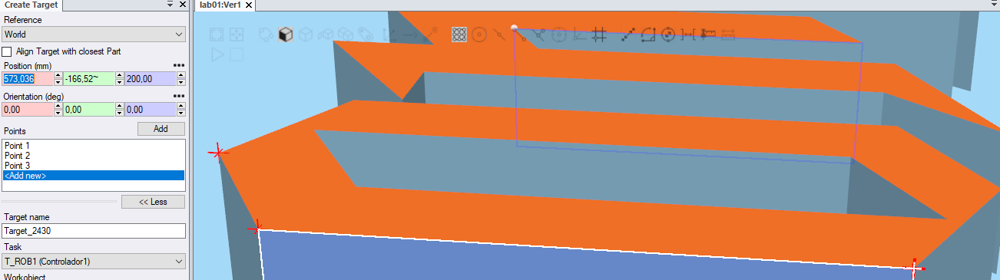
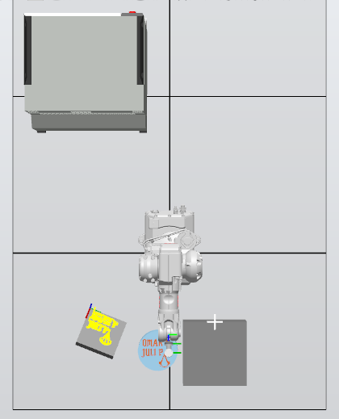
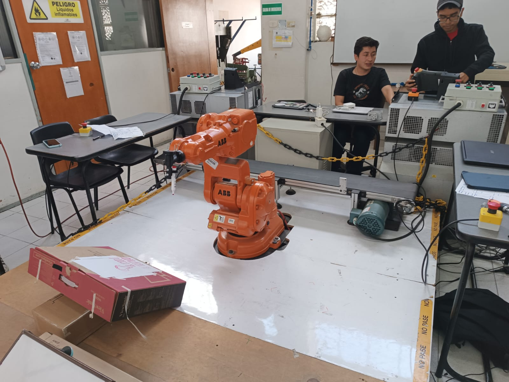

# Laboratorio 1 Robótica 2024-II
### Integrantes
#### Julian David Pulido Castañeda
#### Omar Armando Pérez Ospino
## Descripción de la solución planteada
### Problemática
En la industria de alimentos, en especial panadería, quieren mejorar su proceso de producción. Ellos consideran que el proceso de decoración de sus tortas puede ser ejecutado por robots. Se propone hacer la decoración de una torta virtual, es decir, sobre una superficie plana bien sea redonda o rectangular, escribir 5 primeras letras de los nombres de cada uno de los integrantes del grupo y una decoracion a su gusto. En este caso se desea generar los <i>paths</i> o los movimientos de robot necesarios para representar las letras y la decoración. 

Se deben tener en cuenta las siguientes restricciones:
<ul>
  <li>El tamaño de la torta es para 20 personas.</li>
  <li>Las trayectorias a desarrollar deberan realizarse en un rango de velocidades entre 100 y 1000.</li>
  <li>La zona tolerable de errores maxima debe ser de z10.</li>
  <li>El movimiento debe partir de una posición home especificada (puede ser el home del robot), realizar la trayectoria de cada palabra y decoración con un trazo continuo. El movimiento debe finalizar en la misma posicion de home en la que se inicio.</li>
  <li>La decoracion de la torta debe ser realizada sobre una papel. El papel puede ser fijado sobre una superficie horizontal o sobre una plano inclinado.</li>
  <li>Los nombres deben estar separados.</li>
  
</ul>

Además se deben incluir señales de entrada y salidas. Se deben crear dos entradas y dos salidas digitales configurándolas correctamente en el codigo de RAPID.

<ul>
  <li>La primera señal de entrada debe iniciar una rutina de decorado sobre cualquier superficie y encender una luz de indicacion. Al final de la rutina el brazo debe regresar a su posicion de HOME donde todos los angulos articulares son 0 grados.</li>
  <li>La segunda señal de entrada debe posicionar el brazo en una pose de mantenimiento donde se pueda instalar o desinstalar la herramienta y se indique el estado con la segunda luz.</li>
</ul>


<div align="center">
  
  <p>Figura 1. Distribucion posble de planta.</p>
</div>


### Solucion

En cuanto a la solucion, se plantea el tamaño que debe tener un pastel circular para 20 personas por lo cual se realiza la consulta y se obtiene el dato de que en promedio este es de un tamaño de 25 cm de diametro con una altura de entre 10 y 20 cm. Por lo cual se parte de estas dimensiones para realizar los recorridos de las decoraciones.

Para los nombres, se usaron los primeros nombres o abreviaciones de los mismo, ademas de la primera letra del apellido de cada integrante. Ademas, con el fin de crear un diseño simple pero llamativo con los nombres, se usa una recreacion de la fuente usado en videojuego <i>Devil May Cry 5</i> como fuente base del diseño.

<div align="center">
  
  <p>Figura 2. Nombres con fuente estilizada.</p>
</div>

En cuento a la decoracion, se busco usar un logo ya existen con el fin de agilizar el trazado de las trayectorias del robot. Se opto por el emblema de la saga <i>Assassin's Creed</i> debido a que presenta un equlibrio optimo entre simplicidad y complejidad.

<div align="center">
  
  <p>Figura 3. Emblema <i>Assassin's Creed</i>.</p>
</div>

Por ultimo se modelan estos dibujos junto a las dimensiones del pastel en un entorno 3D (<i>OnShape</i>) con el fin de facilitar la creacion de puntos y trayectorias en <i>RobotStudio</i> mediante la seleccion de vertices que permite el software.

<div align="center">
  
  <p>Figura 4. CAD Pastel decorado.</p>
</div>

<div align="center">
  
  <p>Figura 5. Creacion de objetivos mediante vertices del modelo 3D.</p>
</div>

<div align="center">
  
  <p>Figura 6. Creacion de trayectoria.</p>
</div>

## Diagrama de flujo de acciones del robot

Se planteo el siguiente diagrama de flujo sobre las acciones que el robot debe cumplir para dar solucion a la problematica planteada.

<div align="center">
  
  <p>Figura 7. Diagrama de Fujo de las acciones del robot.</p>
</div>

En primera instancia se da un reinicio general a los testigos y posicion con el fin de evitar problemas durante la ejecucion de las rutinas. Posteriormente, se evalua si la primera entrada digital esta activa:

<ul>
<li> En caso afirmativo, se enciende el testigo correspondiente y ejecuta la rutina de los nombres y el logo en orden, y por ultimo de vuelve el manipulador a su posicion inicial y apaga el testigo.
<li> En caso neagtivo, continua a la siguinete funcion.
</li>
</ul>

La siguiente funcion corresponde a evaluar si la segunda entrada digital esta activa:

<ul>
<li> En caso afirmativo, se enciende el testigo correspondiente y pociona el manipulador en su ubicacion de mantenimiento, y espera hasta que se vuelva a activar la segunda entrada digital. Si se activa la señal, el manipulador vuelve a su posicon incial y apaga el testigo.
<li> En caso negativo, continua a la siguinete funcion.
</li>  
</ul>

Ambas condiciones estan en un ciclo perpetuo, por lo cual si ninguna de la señales de entra es accionada, se repeti el ciclo de verificacion hasta que alguna sea activada.

## Plano de planta de la ubicación de cada uno de los elementos

En caunto a la dsitribucion de los objetos usados duarnte la practica, tanto en soimulacion como en la realidad se realizo de manera empirica, siendo la diferencia mas notable que la planat virtual se dispone de 2 superficies: una inclinida y una sin inclinar con el fin de poder ajustar el <i>Workobject</i> de manera mas facil.

<div align="center">
  
  <p>Figura 8. Distribucion de planta virtual.</p>
</div>

<div align="center">
  
  <p>Figura 9. Distribucion de planta virtual con unidad de control.</p>
</div>

En caunto a planat real, solo se dispuso de una unica superficie la cual se ubico de forma empirica y se ajusto segun los resultados de los ensayos hasta dar con una ubicacion donde las trayectorias se eejcutaron correctamente, por lo cual el <i>Workobject</i> virtual y el  <i>Workobject</i> real nunca coincidieron y este ultimo se ajusto segun las superficies de soporte que se disponion duarante las practicas.

<div align="center">
  
  <p>Figura 10. Distribucion de planta real vista isometrica.</p>
</div>

<div align="center">
  
  <p>Figura 11. Distribucion de planta real lateral.</p>
</div>


## Descripción de las funciones utilizadas

<ul>
  <li><code>main()</code> Es la función principal del programa, llama a todas las funciones que realizan el movimiento del manipulador y contiene toda la lógica de la entradas y salidas digitales.
  <li><code>goHome()</code> Posee una sola instrucción tipo MoveAbsJ que envía todas las articulaciones del robot a cero.</li>
  <li><code>mantenimiento()</code> De manera similar a <code>goHome()</code>, esta función utiliza una instrucción MoveAbsJ para envíar las articulaciones del robot a una posición específica. En este caso envía las articulaciones 3 y 5 a las posiciones -30° y -50°, respectivamente.</li>
  <li><code>omarp()</code></li> Realiza la trayectoria que dibuja la secuencia de letras "omar p".
  <li><code>julip()</code></li> Realiza la trayectoria que dibuja la secuencia de letras "juli p".
  <li><code>logo()</code></li> Realiza la trayectoria que dibuja el logo diseñado.
</ul>

## Diseño de la herramienta
Para el diseño de la herramienta se buscó que fuese posible cambiar fácilmente el instrumento de escritura, que en este caso se trata de un marcador borrable, y que a su vez éste se encuentre correctamente firmemente agarrado a la herramienta. Para ello se ha diseñado una abrazadera (figura 1), que se ajusta a objetos cilíndricos de aproximadamente 16 mm, que es la medida del diámetro del tipo de marcador usado.

<div align="center">
  
  <p>Figura 12. Abrazadera diseñada para sostener el elemento de escritura.</p>
</div>

Adicionalmente, se ha diseñado en la herramienta una junta prismática de cuenta con un resorte para permitir un cierto grado de error en el posicionamiento del marcador. El resultado final de la herramienta diseñada se muestra en la figura 2.

<div align="center">
  
  <p>Figura 13. Modelo CAD de la herramienta diseñada.</p>
</div>

La fabricación de la herramienta diseñada se realizó con el método manufactura aditiva utilizando PLA. En la figura 3 se muestra la herramienta fabricada.

<div align="center">
  
  <p>Figura 14. Foto de la herramienta fabricada en PLA por medio de manufactura aditiva.</p>
</div>

Para hallar el TCP se utilizaron dos métodos: el primero fue utilizar el TCP calculado directamente mediante RobotStudio utilizando el modelo CAD y el segundo fue directamente en el FlexPendant mediante el método de definición TCP & Z. En la tabla 1 se muestra una comparación entre los resultados obtenidos mediante los dos métodos.

<table align="center">
  <tr>
    <th>TCP</th>
    <th>CAD</th>
    <th>Manual</th>
  </tr>
  <tr>
    <td>x</td>
    <td>148.954</td>
    <td>142.652</td>
  </tr>
  <tr>
    <td>y</td>
    <td>0</td>
    <td>37.0488</td>
  </tr>
  <tr>
    <td>z</td>
    <td>67.083</td>
    <td>68.0102</td>
  </tr>
  <tr>
    <td>q1</td>
    <td>0.793353</td>
    <td>0.94672</td>
  </tr>
  <tr>
    <td>q2</td>
    <td>0</td>
    <td>0.284099</td>
  </tr>
  <tr>
    <td>q3</td>
    <td>0.608761</td>
    <td>0.145287</td>
  </tr>
  <tr>
    <td>q4</td>
    <td>0</td>
    <td>0.0435988</td>
  </tr>
</table>
<p align="center">Tabla 1. Comparación de valores de TCP obtenidos por medio del modelo CAD y de manera manual por el método TCP & Z.</p>


<div align="center">
  
  <p>Figura 15. Herramienta instalada en manipulador.</p>
</div>


## Código en RAPID del módulo utilizado para el desarrollo de la practica.

```
MODULE Module1
    PERS tooldata toolx:=[TRUE,[[148.954,0,67.083],[0.79335334,0,0.608761429,0]],[1,[0,0,1],[1,0,0,0],0,0,0]];
    TASK PERS wobjdata Workobject_2:=[FALSE,TRUE,"",[[346.241433789,-502.55410708,96.953891786],[0.949400236,-0.04857085,-0.254080575,-0.178109869]],[[0,0,0],[1,0,0,0]]];
    CONST robtarget Target_10:=[[25.302,30.991,100],[0,0,1,0],[-1,1,-2,0],[9E+09,9E+09,9E+09,9E+09,9E+09,9E+09]];
    CONST robtarget Target_20:=[[25.302,30.991,0],[0,0,1,0],[-1,1,-2,0],[9E+09,9E+09,9E+09,9E+09,9E+09,9E+09]];
    CONST robtarget Target_30:=[[61.365,30.991,0],[0,0,1,0],[-1,1,-2,0],[9E+09,9E+09,9E+09,9E+09,9E+09,9E+09]];
    CONST robtarget Target_40:=[[67.105,42.767,0],[0,0,1,0],[-1,1,-2,0],[9E+09,9E+09,9E+09,9E+09,9E+09,9E+09]];
    CONST robtarget Target_50:=[[61.365,52.776,0],[0,0,1,0],[-1,1,-2,0],[9E+09,9E+09,9E+09,9E+09,9E+09,9E+09]];
    CONST robtarget Target_60:=[[24.418,52.776,0],[0,0,1,0],[-1,1,-2,0],[9E+09,9E+09,9E+09,9E+09,9E+09,9E+09]];
    CONST robtarget Target_70:=[[18.825,41.884,0],[0,0,1,0],[-1,1,-2,0],[9E+09,9E+09,9E+09,9E+09,9E+09,9E+09]];
    CONST robtarget Target_80:=[[25.302,30.991,0],[0,0,1,0],[-1,1,-2,0],[9E+09,9E+09,9E+09,9E+09,9E+09,9E+09]];
    CONST robtarget Target_90:=[[25.302,30.991,30],[0,0,1,0],[-1,1,-2,0],[9E+09,9E+09,9E+09,9E+09,9E+09,9E+09]];
    CONST robtarget Target_100:=[[27.714,53.347,30],[0,0,1,0],[-1,1,-2,0],[9E+09,9E+09,9E+09,9E+09,9E+09,9E+09]];
    CONST robtarget Target_110:=[[27.714,53.347,0],[0,0,1,0],[-1,1,-2,0],[9E+09,9E+09,9E+09,9E+09,9E+09,9E+09]];
    CONST robtarget Target_120:=[[27.714,59.499,0],[0,0,1,0],[-1,1,-2,0],[9E+09,9E+09,9E+09,9E+09,9E+09,9E+09]];
    CONST robtarget Target_130:=[[60.706,59.499,0],[0,0,1,0],[-1,1,-2,0],[9E+09,9E+09,9E+09,9E+09,9E+09,9E+09]];
    CONST robtarget Target_140:=[[68.758,51.972,0],[0,0,1,0],[-1,1,-2,0],[9E+09,9E+09,9E+09,9E+09,9E+09,9E+09]];
    CONST robtarget Target_150:=[[61.756,66.151,0],[0,0,1,0],[-1,1,-2,0],[9E+09,9E+09,9E+09,9E+09,9E+09,9E+09]];
    CONST robtarget Target_160:=[[34.974,66.151,0],[0,0,1,0],[-1,1,-2,0],[9E+09,9E+09,9E+09,9E+09,9E+09,9E+09]];
    CONST robtarget Target_170:=[[32.173,71.052,0],[0,0,1,0],[-1,1,-2,0],[9E+09,9E+09,9E+09,9E+09,9E+09,9E+09]];
    CONST robtarget Target_180:=[[59.48,71.052,0],[0,0,1,0],[-1,1,-2,0],[9E+09,9E+09,9E+09,9E+09,9E+09,9E+09]];
    CONST robtarget Target_190:=[[55.36,77.652,0],[0,0,1,0],[-1,1,-2,0],[9E+09,9E+09,9E+09,9E+09,9E+09,9E+09]];
    CONST robtarget Target_200:=[[34.9,77.652,0],[0,0,1,0],[-1,1,-2,0],[9E+09,9E+09,9E+09,9E+09,9E+09,9E+09]];
    CONST robtarget Target_210:=[[31.956,82.215,0],[0,0,1,0],[-1,1,-2,0],[9E+09,9E+09,9E+09,9E+09,9E+09,9E+09]];
    CONST robtarget Target_220:=[[67.748,82.215,0],[0,0,1,0],[-1,1,-2,0],[9E+09,9E+09,9E+09,9E+09,9E+09,9E+09]];
    CONST robtarget Target_230:=[[58.605,95.734,0],[0,0,1,0],[-1,1,-2,0],[9E+09,9E+09,9E+09,9E+09,9E+09,9E+09]];
    CONST robtarget Target_240:=[[58.605,88.907,0],[0,0,1,0],[-1,1,-2,0],[9E+09,9E+09,9E+09,9E+09,9E+09,9E+09]];
    CONST robtarget Target_250:=[[19.745,88.907,0],[0,0,1,0],[-1,1,-2,0],[9E+09,9E+09,9E+09,9E+09,9E+09,9E+09]];
    CONST robtarget Target_260:=[[26.572,77.354,0],[0,0,1,0],[-1,1,-2,0],[9E+09,9E+09,9E+09,9E+09,9E+09,9E+09]];
    CONST robtarget Target_270:=[[20.095,77.354,0],[0,0,1,0],[-1,1,-2,0],[9E+09,9E+09,9E+09,9E+09,9E+09,9E+09]];
    CONST robtarget Target_280:=[[26.922,65.976,0],[0,0,1,0],[-1,1,-2,0],[9E+09,9E+09,9E+09,9E+09,9E+09,9E+09]];
    CONST robtarget Target_290:=[[18.87,65.976,0],[0,0,1,0],[-1,1,-2,0],[9E+09,9E+09,9E+09,9E+09,9E+09,9E+09]];
    CONST robtarget Target_300:=[[27.714,53.347,0],[0,0,1,0],[-1,1,-2,0],[9E+09,9E+09,9E+09,9E+09,9E+09,9E+09]];
    CONST robtarget Target_310:=[[27.714,53.347,30],[0,0,1,0],[-1,1,-2,0],[9E+09,9E+09,9E+09,9E+09,9E+09,9E+09]];
    CONST robtarget Target_320:=[[23.98,104.878,30],[0,0,1,0],[-1,1,-2,0],[9E+09,9E+09,9E+09,9E+09,9E+09,9E+09]];
    CONST robtarget Target_330:=[[23.98,104.878,0],[0,0,1,0],[-1,1,-2,0],[9E+09,9E+09,9E+09,9E+09,9E+09,9E+09]];
    CONST robtarget Target_340:=[[62.492,96.56,0],[0,0,1,0],[-1,1,-2,0],[9E+09,9E+09,9E+09,9E+09,9E+09,9E+09]];
    CONST robtarget Target_350:=[[70.22,90.23,0],[0,0,1,0],[-1,1,-2,0],[9E+09,9E+09,9E+09,9E+09,9E+09,9E+09]];
    CONST robtarget Target_360:=[[62.179,103.629,0],[0,0,1,0],[-1,1,-2,0],[9E+09,9E+09,9E+09,9E+09,9E+09,9E+09]];
    CONST robtarget Target_370:=[[49.793,106.336,0],[0,0,1,0],[-1,1,-2,0],[9E+09,9E+09,9E+09,9E+09,9E+09,9E+09]];
    CONST robtarget Target_380:=[[49.793,113.309,0],[0,0,1,0],[-1,1,-2,0],[9E+09,9E+09,9E+09,9E+09,9E+09,9E+09]];
    CONST robtarget Target_390:=[[67.695,116.224,0],[0,0,1,0],[-1,1,-2,0],[9E+09,9E+09,9E+09,9E+09,9E+09,9E+09]];
    CONST robtarget Target_400:=[[58.848,129.546,0],[0,0,1,0],[-1,1,-2,0],[9E+09,9E+09,9E+09,9E+09,9E+09,9E+09]];
    CONST robtarget Target_410:=[[58.848,122.469,0],[0,0,1,0],[-1,1,-2,0],[9E+09,9E+09,9E+09,9E+09,9E+09,9E+09]];
    CONST robtarget Target_420:=[[17.943,116.119,0],[0,0,1,0],[-1,1,-2,0],[9E+09,9E+09,9E+09,9E+09,9E+09,9E+09]];
    CONST robtarget Target_430:=[[23.98,104.878,0],[0,0,1,0],[-1,1,-2,0],[9E+09,9E+09,9E+09,9E+09,9E+09,9E+09]];
    CONST robtarget Target_440:=[[23.98,104.878,30],[0,0,1,0],[-1,1,-2,0],[9E+09,9E+09,9E+09,9E+09,9E+09,9E+09]];
    CONST robtarget Target_450:=[[28.556,123.595,30],[0,0,1,0],[-1,1,-2,0],[9E+09,9E+09,9E+09,9E+09,9E+09,9E+09]];
    CONST robtarget Target_460:=[[28.556,123.595,0],[0,0,1,0],[-1,1,-2,0],[9E+09,9E+09,9E+09,9E+09,9E+09,9E+09]];
    CONST robtarget Target_470:=[[28.556,131.263,0],[0,0,1,0],[-1,1,-2,0],[9E+09,9E+09,9E+09,9E+09,9E+09,9E+09]];
    CONST robtarget Target_480:=[[66.839,131.263,0],[0,0,1,0],[-1,1,-2,0],[9E+09,9E+09,9E+09,9E+09,9E+09,9E+09]];
    CONST robtarget Target_490:=[[63.38,137.518,0],[0,0,1,0],[-1,1,-2,0],[9E+09,9E+09,9E+09,9E+09,9E+09,9E+09]];
    CONST robtarget Target_500:=[[46.894,137.518,0],[0,0,1,0],[-1,1,-2,0],[9E+09,9E+09,9E+09,9E+09,9E+09,9E+09]];
    CONST robtarget Target_510:=[[52.34,146.497,0],[0,0,1,0],[-1,1,-2,0],[9E+09,9E+09,9E+09,9E+09,9E+09,9E+09]];
    CONST robtarget Target_520:=[[67.06,146.497,0],[0,0,1,0],[-1,1,-2,0],[9E+09,9E+09,9E+09,9E+09,9E+09,9E+09]];
    CONST robtarget Target_530:=[[59.004,160.012,0],[0,0,1,0],[-1,1,-2,0],[9E+09,9E+09,9E+09,9E+09,9E+09,9E+09]];
    CONST robtarget Target_540:=[[59.004,152.806,0],[0,0,1,0],[-1,1,-2,0],[9E+09,9E+09,9E+09,9E+09,9E+09,9E+09]];
    CONST robtarget Target_550:=[[48.627,152.806,0],[0,0,1,0],[-1,1,-2,0],[9E+09,9E+09,9E+09,9E+09,9E+09,9E+09]];
    CONST robtarget Target_560:=[[45.018,146.246,0],[0,0,1,0],[-1,1,-2,0],[9E+09,9E+09,9E+09,9E+09,9E+09,9E+09]];
    CONST robtarget Target_570:=[[41.057,152.806,0],[0,0,1,0],[-1,1,-2,0],[9E+09,9E+09,9E+09,9E+09,9E+09,9E+09]];
    CONST robtarget Target_580:=[[23.357,152.806,0],[0,0,1,0],[-1,1,-2,0],[9E+09,9E+09,9E+09,9E+09,9E+09,9E+09]];
    CONST robtarget Target_590:=[[20.882,147.483,0],[0,0,1,0],[-1,1,-2,0],[9E+09,9E+09,9E+09,9E+09,9E+09,9E+09]];
    CONST robtarget Target_600:=[[26.823,137.086,0],[0,0,1,0],[-1,1,-2,0],[9E+09,9E+09,9E+09,9E+09,9E+09,9E+09]];
    CONST robtarget Target_610:=[[18.901,137.086,0],[0,0,1,0],[-1,1,-2,0],[9E+09,9E+09,9E+09,9E+09,9E+09,9E+09]];
    CONST robtarget Target_620:=[[28.556,123.595,0],[0,0,1,0],[-1,1,-2,0],[9E+09,9E+09,9E+09,9E+09,9E+09,9E+09]];
    CONST robtarget Target_630:=[[28.556,123.595,30],[0,0,1,0],[-1,1,-2,0],[9E+09,9E+09,9E+09,9E+09,9E+09,9E+09]];
    CONST robtarget Target_640:=[[28.524,169.09,30],[0,0,1,0],[-1,1,-2,0],[9E+09,9E+09,9E+09,9E+09,9E+09,9E+09]];
    CONST robtarget Target_650:=[[28.524,169.09,0],[0,0,1,0],[-1,1,-2,0],[9E+09,9E+09,9E+09,9E+09,9E+09,9E+09]];
    CONST robtarget Target_660:=[[28.524,175.96,0],[0,0,1,0],[-1,1,-2,0],[9E+09,9E+09,9E+09,9E+09,9E+09,9E+09]];
    CONST robtarget Target_670:=[[67.451,175.96,0],[0,0,1,0],[-1,1,-2,0],[9E+09,9E+09,9E+09,9E+09,9E+09,9E+09]];
    CONST robtarget Target_680:=[[58.812,190.531,0],[0,0,1,0],[-1,1,-2,0],[9E+09,9E+09,9E+09,9E+09,9E+09,9E+09]];
    CONST robtarget Target_690:=[[58.812,181.58,0],[0,0,1,0],[-1,1,-2,0],[9E+09,9E+09,9E+09,9E+09,9E+09,9E+09]];
    CONST robtarget Target_700:=[[34.353,181.58,0],[0,0,1,0],[-1,1,-2,0],[9E+09,9E+09,9E+09,9E+09,9E+09,9E+09]];
    CONST robtarget Target_710:=[[29.253,190.427,0],[0,0,1,0],[-1,1,-2,0],[9E+09,9E+09,9E+09,9E+09,9E+09,9E+09]];
    CONST robtarget Target_720:=[[38.204,190.427,0],[0,0,1,0],[-1,1,-2,0],[9E+09,9E+09,9E+09,9E+09,9E+09,9E+09]];
    CONST robtarget Target_730:=[[43.512,182.933,0],[0,0,1,0],[-1,1,-2,0],[9E+09,9E+09,9E+09,9E+09,9E+09,9E+09]];
    CONST robtarget Target_740:=[[47.467,187.721,0],[0,0,1,0],[-1,1,-2,0],[9E+09,9E+09,9E+09,9E+09,9E+09,9E+09]];
    CONST robtarget Target_750:=[[42.263,197.713,0],[0,0,1,0],[-1,1,-2,0],[9E+09,9E+09,9E+09,9E+09,9E+09,9E+09]];
    CONST robtarget Target_760:=[[25.506,197.713,0],[0,0,1,0],[-1,1,-2,0],[9E+09,9E+09,9E+09,9E+09,9E+09,9E+09]];
    CONST robtarget Target_770:=[[21.238,190.635,0],[0,0,1,0],[-1,1,-2,0],[9E+09,9E+09,9E+09,9E+09,9E+09,9E+09]];
    CONST robtarget Target_780:=[[26.859,181.476,0],[0,0,1,0],[-1,1,-2,0],[9E+09,9E+09,9E+09,9E+09,9E+09,9E+09]];
    CONST robtarget Target_790:=[[19.053,181.476,0],[0,0,1,0],[-1,1,-2,0],[9E+09,9E+09,9E+09,9E+09,9E+09,9E+09]];
    CONST robtarget Target_800:=[[28.524,169.09,0],[0,0,1,0],[-1,1,-2,0],[9E+09,9E+09,9E+09,9E+09,9E+09,9E+09]];
    CONST robtarget Target_810:=[[28.524,169.09,30],[0,0,1,0],[-1,1,-2,0],[9E+09,9E+09,9E+09,9E+09,9E+09,9E+09]];
    CONST robtarget Target_820:=[[29.96,145.179,30],[0,0,1,0],[-1,1,-2,0],[9E+09,9E+09,9E+09,9E+09,9E+09,9E+09]];
    CONST robtarget Target_830:=[[29.96,145.179,0],[0,0,1,0],[-1,1,-2,0],[9E+09,9E+09,9E+09,9E+09,9E+09,9E+09]];
    CONST robtarget Target_840:=[[34.416,137.257,0],[0,0,1,0],[-1,1,-2,0],[9E+09,9E+09,9E+09,9E+09,9E+09,9E+09]];
    CONST robtarget Target_850:=[[42.461,137.257,0],[0,0,1,0],[-1,1,-2,0],[9E+09,9E+09,9E+09,9E+09,9E+09,9E+09]];
    CONST robtarget Target_860:=[[37.386,145.179,0],[0,0,1,0],[-1,1,-2,0],[9E+09,9E+09,9E+09,9E+09,9E+09,9E+09]];
    CONST robtarget Target_870:=[[29.96,145.179,0],[0,0,1,0],[-1,1,-2,0],[9E+09,9E+09,9E+09,9E+09,9E+09,9E+09]];
    CONST robtarget Target_880:=[[29.96,145.179,30],[0,0,1,0],[-1,1,-2,0],[9E+09,9E+09,9E+09,9E+09,9E+09,9E+09]];
    CONST robtarget Target_890:=[[28.039,110.083,30],[0,0,1,0],[-1,1,-2,0],[9E+09,9E+09,9E+09,9E+09,9E+09,9E+09]];
    CONST robtarget Target_900:=[[28.039,110.083,0],[0,0,1,0],[-1,1,-2,0],[9E+09,9E+09,9E+09,9E+09,9E+09,9E+09]];
    CONST robtarget Target_910:=[[43.132,107.168,0],[0,0,1,0],[-1,1,-2,0],[9E+09,9E+09,9E+09,9E+09,9E+09,9E+09]];
    CONST robtarget Target_920:=[[43.132,111.956,0],[0,0,1,0],[-1,1,-2,0],[9E+09,9E+09,9E+09,9E+09,9E+09,9E+09]];
    CONST robtarget Target_930:=[[28.039,110.083,0],[0,0,1,0],[-1,1,-2,0],[9E+09,9E+09,9E+09,9E+09,9E+09,9E+09]];
    CONST robtarget Target_940:=[[28.039,110.083,30],[0,0,1,0],[-1,1,-2,0],[9E+09,9E+09,9E+09,9E+09,9E+09,9E+09]];
    CONST robtarget Target_950:=[[23.478,46.741,30],[0,0,1,0],[-1,1,-2,0],[9E+09,9E+09,9E+09,9E+09,9E+09,9E+09]];
    CONST robtarget Target_960:=[[23.478,46.741,0],[0,0,1,0],[-1,1,-2,0],[9E+09,9E+09,9E+09,9E+09,9E+09,9E+09]];
    CONST robtarget Target_970:=[[28.982,37.762,0],[0,0,1,0],[-1,1,-2,0],[9E+09,9E+09,9E+09,9E+09,9E+09,9E+09]];
    CONST robtarget Target_980:=[[63.58,37.762,0],[0,0,1,0],[-1,1,-2,0],[9E+09,9E+09,9E+09,9E+09,9E+09,9E+09]];
    CONST robtarget Target_990:=[[58.274,46.741,0],[0,0,1,0],[-1,1,-2,0],[9E+09,9E+09,9E+09,9E+09,9E+09,9E+09]];
    CONST robtarget Target_1000:=[[23.478,46.741,0],[0,0,1,0],[-1,1,-2,0],[9E+09,9E+09,9E+09,9E+09,9E+09,9E+09]];
    CONST robtarget Target_1010:=[[23.478,46.741,30],[0,0,1,0],[-1,1,-2,0],[9E+09,9E+09,9E+09,9E+09,9E+09,9E+09]];
    CONST jointtarget JointTarget_3:=[[0,0,0,0,0,0],[9E+09,9E+09,9E+09,9E+09,9E+09,9E+09]];
    CONST robtarget Target_1020:=[[88.053795712,24.917790512,80],[0,0,1,0],[-1,1,-2,0],[9E+09,9E+09,9E+09,9E+09,9E+09,9E+09]];
    CONST robtarget Target_1030:=[[88.054,24.918,0],[0,0,1,0],[-1,1,-2,0],[9E+09,9E+09,9E+09,9E+09,9E+09,9E+09]];
    CONST robtarget Target_1040:=[[88.054,34.711,0],[0,0,1,0],[-1,1,-2,0],[9E+09,9E+09,9E+09,9E+09,9E+09,9E+09]];
    CONST robtarget Target_1050:=[[130.24,34.711,0],[0,0,1,0],[-1,1,-2,0],[9E+09,9E+09,9E+09,9E+09,9E+09,9E+09]];
    CONST robtarget Target_1060:=[[125.164,26.659,0],[0,0,1,0],[-1,1,-2,0],[9E+09,9E+09,9E+09,9E+09,9E+09,9E+09]];
    CONST robtarget Target_1070:=[[129.015,21.058,0],[0,0,1,0],[-1,1,-2,0],[9E+09,9E+09,9E+09,9E+09,9E+09,9E+09]];
    CONST robtarget Target_1080:=[[135.492,31.911,0],[0,0,1,0],[-1,1,-2,0],[9E+09,9E+09,9E+09,9E+09,9E+09,9E+09]];
    CONST robtarget Target_1090:=[[128.665,41.888,0],[0,0,1,0],[-1,1,-2,0],[9E+09,9E+09,9E+09,9E+09,9E+09,9E+09]];
    CONST robtarget Target_1100:=[[77.376,41.888,0],[0,0,1,0],[-1,1,-2,0],[9E+09,9E+09,9E+09,9E+09,9E+09,9E+09]];
    CONST robtarget Target_1110:=[[88.054,24.918,0],[0,0,1,0],[-1,1,-2,0],[9E+09,9E+09,9E+09,9E+09,9E+09,9E+09]];
    CONST robtarget Target_1120:=[[88.054,24.918,30],[0,0,1,0],[-1,1,-2,0],[9E+09,9E+09,9E+09,9E+09,9E+09,9E+09]];
    CONST robtarget Target_1130:=[[87.489,43.728,0],[0,0,1,0],[-1,1,-2,0],[9E+09,9E+09,9E+09,9E+09,9E+09,9E+09]];
    CONST robtarget Target_1140:=[[87.489,50.177,0],[0,0,1,0],[-1,1,-2,0],[9E+09,9E+09,9E+09,9E+09,9E+09,9E+09]];
    CONST robtarget Target_1150:=[[120.072,50.177,0],[0,0,1,0],[-1,1,-2,0],[9E+09,9E+09,9E+09,9E+09,9E+09,9E+09]];
    CONST robtarget Target_1160:=[[126.421,61.314,0],[0,0,1,0],[-1,1,-2,0],[9E+09,9E+09,9E+09,9E+09,9E+09,9E+09]];
    CONST robtarget Target_1170:=[[123.61,66.726,0],[0,0,1,0],[-1,1,-2,0],[9E+09,9E+09,9E+09,9E+09,9E+09,9E+09]];
    CONST robtarget Target_1180:=[[125.588,69.745,0],[0,0,1,0],[-1,1,-2,0],[9E+09,9E+09,9E+09,9E+09,9E+09,9E+09]];
    CONST robtarget Target_1190:=[[120.072,77.343,0],[0,0,1,0],[-1,1,-2,0],[9E+09,9E+09,9E+09,9E+09,9E+09,9E+09]];
    CONST robtarget Target_1200:=[[120.072,72.176,0],[0,0,1,0],[-1,1,-2,0],[9E+09,9E+09,9E+09,9E+09,9E+09,9E+09]];
    CONST robtarget Target_1210:=[[77.603,72.176,0],[0,0,1,0],[-1,1,-2,0],[9E+09,9E+09,9E+09,9E+09,9E+09,9E+09]];
    CONST robtarget Target_1220:=[[81.979,65.13,0],[0,0,1,0],[-1,1,-2,0],[9E+09,9E+09,9E+09,9E+09,9E+09,9E+09]];
    CONST robtarget Target_1230:=[[116.392,65.13,0],[0,0,1,0],[-1,1,-2,0],[9E+09,9E+09,9E+09,9E+09,9E+09,9E+09]];
    CONST robtarget Target_1240:=[[120.91,56.876,0],[0,0,1,0],[-1,1,-2,0],[9E+09,9E+09,9E+09,9E+09,9E+09,9E+09]];
    CONST robtarget Target_1250:=[[77.381,56.876,0],[0,0,1,0],[-1,1,-2,0],[9E+09,9E+09,9E+09,9E+09,9E+09,9E+09]];
    CONST robtarget Target_1260:=[[87.489,43.728,0],[0,0,1,0],[-1,1,-2,0],[9E+09,9E+09,9E+09,9E+09,9E+09,9E+09]];
    CONST robtarget Target_1270:=[[87.489,43.728,30],[0,0,1,0],[-1,1,-2,0],[9E+09,9E+09,9E+09,9E+09,9E+09,9E+09]];
    CONST robtarget Target_1280:=[[86.365,73.7,0],[0,0,1,0],[-1,1,-2,0],[9E+09,9E+09,9E+09,9E+09,9E+09,9E+09]];
    CONST robtarget Target_1290:=[[86.365,80.093,0],[0,0,1,0],[-1,1,-2,0],[9E+09,9E+09,9E+09,9E+09,9E+09,9E+09]];
    CONST robtarget Target_1300:=[[121.605,80.093,0],[0,0,1,0],[-1,1,-2,0],[9E+09,9E+09,9E+09,9E+09,9E+09,9E+09]];
    CONST robtarget Target_1310:=[[123.709,76.813,0],[0,0,1,0],[-1,1,-2,0],[9E+09,9E+09,9E+09,9E+09,9E+09,9E+09]];
    CONST robtarget Target_1320:=[[123.709,95.194,0],[0,0,1,0],[-1,1,-2,0],[9E+09,9E+09,9E+09,9E+09,9E+09,9E+09]];
    CONST robtarget Target_1330:=[[114.921,102.496,0],[0,0,1,0],[-1,1,-2,0],[9E+09,9E+09,9E+09,9E+09,9E+09,9E+09]];
    CONST robtarget Target_1340:=[[117.621,97.284,0],[0,0,1,0],[-1,1,-2,0],[9E+09,9E+09,9E+09,9E+09,9E+09,9E+09]];
    CONST robtarget Target_1350:=[[117.621,86.727,0],[0,0,1,0],[-1,1,-2,0],[9E+09,9E+09,9E+09,9E+09,9E+09,9E+09]];
    CONST robtarget Target_1360:=[[78.343,86.727,0],[0,0,1,0],[-1,1,-2,0],[9E+09,9E+09,9E+09,9E+09,9E+09,9E+09]];
    CONST robtarget Target_1370:=[[86.365,73.7,0],[0,0,1,0],[-1,1,-2,0],[9E+09,9E+09,9E+09,9E+09,9E+09,9E+09]];
    CONST robtarget Target_1380:=[[86.365,73.7,30],[0,0,1,0],[-1,1,-2,0],[9E+09,9E+09,9E+09,9E+09,9E+09,9E+09]];
    CONST robtarget Target_1390:=[[87.776,96.145,0],[0,0,1,0],[-1,1,-2,0],[9E+09,9E+09,9E+09,9E+09,9E+09,9E+09]];
    CONST robtarget Target_1400:=[[87.776,103.695,0],[0,0,1,0],[-1,1,-2,0],[9E+09,9E+09,9E+09,9E+09,9E+09,9E+09]];
    CONST robtarget Target_1410:=[[126.047,103.695,0],[0,0,1,0],[-1,1,-2,0],[9E+09,9E+09,9E+09,9E+09,9E+09,9E+09]];
    CONST robtarget Target_1420:=[[117.621,118.268,0],[0,0,1,0],[-1,1,-2,0],[9E+09,9E+09,9E+09,9E+09,9E+09,9E+09]];
    CONST robtarget Target_1430:=[[117.621,110.908,0],[0,0,1,0],[-1,1,-2,0],[9E+09,9E+09,9E+09,9E+09,9E+09,9E+09]];
    CONST robtarget Target_1440:=[[77.62,110.908,0],[0,0,1,0],[-1,1,-2,0],[9E+09,9E+09,9E+09,9E+09,9E+09,9E+09]];
    CONST robtarget Target_1450:=[[87.776,96.145,0],[0,0,1,0],[-1,1,-2,0],[9E+09,9E+09,9E+09,9E+09,9E+09,9E+09]];
    CONST robtarget Target_1460:=[[87.776,96.145,30],[0,0,1,0],[-1,1,-2,0],[9E+09,9E+09,9E+09,9E+09,9E+09,9E+09]];
    CONST robtarget Target_1470:=[[87.559,127.676,0],[0,0,1,0],[-1,1,-2,0],[9E+09,9E+09,9E+09,9E+09,9E+09,9E+09]];
    CONST robtarget Target_1480:=[[87.559,134.299,0],[0,0,1,0],[-1,1,-2,0],[9E+09,9E+09,9E+09,9E+09,9E+09,9E+09]];
    CONST robtarget Target_1490:=[[125.683,134.299,0],[0,0,1,0],[-1,1,-2,0],[9E+09,9E+09,9E+09,9E+09,9E+09,9E+09]];
    CONST robtarget Target_1500:=[[117.293,148.725,0],[0,0,1,0],[-1,1,-2,0],[9E+09,9E+09,9E+09,9E+09,9E+09,9E+09]];
    CONST robtarget Target_1510:=[[117.293,140.482,0],[0,0,1,0],[-1,1,-2,0],[9E+09,9E+09,9E+09,9E+09,9E+09,9E+09]];
    CONST robtarget Target_1520:=[[92.564,140.482,0],[0,0,1,0],[-1,1,-2,0],[9E+09,9E+09,9E+09,9E+09,9E+09,9E+09]];
    CONST robtarget Target_1530:=[[87.707,149.313,0],[0,0,1,0],[-1,1,-2,0],[9E+09,9E+09,9E+09,9E+09,9E+09,9E+09]];
    CONST robtarget Target_1540:=[[96.686,149.313,0],[0,0,1,0],[-1,1,-2,0],[9E+09,9E+09,9E+09,9E+09,9E+09,9E+09]];
    CONST robtarget Target_1550:=[[102.132,140.923,0],[0,0,1,0],[-1,1,-2,0],[9E+09,9E+09,9E+09,9E+09,9E+09,9E+09]];
    CONST robtarget Target_1560:=[[106.253,146.222,0],[0,0,1,0],[-1,1,-2,0],[9E+09,9E+09,9E+09,9E+09,9E+09,9E+09]];
    CONST robtarget Target_1570:=[[100.807,156.232,0],[0,0,1,0],[-1,1,-2,0],[9E+09,9E+09,9E+09,9E+09,9E+09,9E+09]];
    CONST robtarget Target_1580:=[[84.321,156.232,0],[0,0,1,0],[-1,1,-2,0],[9E+09,9E+09,9E+09,9E+09,9E+09,9E+09]];
    CONST robtarget Target_1590:=[[79.464,149.019,0],[0,0,1,0],[-1,1,-2,0],[9E+09,9E+09,9E+09,9E+09,9E+09,9E+09]];
    CONST robtarget Target_1600:=[[85.646,140.334,0],[0,0,1,0],[-1,1,-2,0],[9E+09,9E+09,9E+09,9E+09,9E+09,9E+09]];
    CONST robtarget Target_1610:=[[77.992,140.334,0],[0,0,1,0],[-1,1,-2,0],[9E+09,9E+09,9E+09,9E+09,9E+09,9E+09]];
    CONST robtarget Target_1620:=[[87.559,127.676,0],[0,0,1,0],[-1,1,-2,0],[9E+09,9E+09,9E+09,9E+09,9E+09,9E+09]];
    CONST robtarget Target_1630:=[[87.559,127.676,30],[0,0,1,0],[-1,1,-2,0],[9E+09,9E+09,9E+09,9E+09,9E+09,9E+09]];
    CONST robtarget Target_1640:=[[108.252126131,167.190655355,50],[0,0,1,0],[-1,1,-2,0],[9E+09,9E+09,9E+09,9E+09,9E+09,9E+09]];
    CONST robtarget Target_1650:=[[108.252126131,167.190655355,0],[0,0,1,0],[-1,1,-2,0],[9E+09,9E+09,9E+09,9E+09,9E+09,9E+09]];
    CONST robtarget Target_1660:=[[152.853126131,148.892655355,0],[0,0,1,0],[-1,1,-2,0],[9E+09,9E+09,9E+09,9E+09,9E+09,9E+09]];
    CONST robtarget Target_1670:=[[158.289126131,145.259655355,0],[0,0,1,0],[-1,1,-2,0],[9E+09,9E+09,9E+09,9E+09,9E+09,9E+09]];
    CONST robtarget Target_1680:=[[161.523126131,139.892655355,0],[0,0,1,0],[-1,1,-2,0],[9E+09,9E+09,9E+09,9E+09,9E+09,9E+09]];
    CONST robtarget Target_1690:=[[161.698126131,137.004655355,0],[0,0,1,0],[-1,1,-2,0],[9E+09,9E+09,9E+09,9E+09,9E+09,9E+09]];
    CONST robtarget Target_1700:=[[161.106126131,134.204655355,0],[0,0,1,0],[-1,1,-2,0],[9E+09,9E+09,9E+09,9E+09,9E+09,9E+09]];
    CONST robtarget Target_1710:=[[159.870126131,131.274655355,0],[0,0,1,0],[-1,1,-2,0],[9E+09,9E+09,9E+09,9E+09,9E+09,9E+09]];
    CONST robtarget Target_1720:=[[160.919126131,131.728655355,0],[0,0,1,0],[-1,1,-2,0],[9E+09,9E+09,9E+09,9E+09,9E+09,9E+09]];
    CONST robtarget Target_1730:=[[166.615126131,133.056655355,0],[0,0,1,0],[-1,1,-2,0],[9E+09,9E+09,9E+09,9E+09,9E+09,9E+09]];
    CONST robtarget Target_1740:=[[172.280126131,132.854655355,0],[0,0,1,0],[-1,1,-2,0],[9E+09,9E+09,9E+09,9E+09,9E+09,9E+09]];
    CONST robtarget Target_1750:=[[174.781126131,132.265655355,0],[0,0,1,0],[-1,1,-2,0],[9E+09,9E+09,9E+09,9E+09,9E+09,9E+09]];
    CONST robtarget Target_1760:=[[176.592126131,131.649655355,0],[0,0,1,0],[-1,1,-2,0],[9E+09,9E+09,9E+09,9E+09,9E+09,9E+09]];
    CONST robtarget Target_1770:=[[176.104126131,134.384655355,0],[0,0,1,0],[-1,1,-2,0],[9E+09,9E+09,9E+09,9E+09,9E+09,9E+09]];
    CONST robtarget Target_1780:=[[177.280126131,137.789655355,0],[0,0,1,0],[-1,1,-2,0],[9E+09,9E+09,9E+09,9E+09,9E+09,9E+09]];
    CONST robtarget Target_1790:=[[181.888126131,143.150655355,0],[0,0,1,0],[-1,1,-2,0],[9E+09,9E+09,9E+09,9E+09,9E+09,9E+09]];
    CONST robtarget Target_1800:=[[186.330126131,150.731655355,-0.07],[0,0,1,0],[-1,1,-2,0],[9E+09,9E+09,9E+09,9E+09,9E+09,9E+09]];
    CONST robtarget Target_1810:=[[189.483126131,160.043655355,0],[0,0,1,0],[-1,1,-2,0],[9E+09,9E+09,9E+09,9E+09,9E+09,9E+09]];
    CONST robtarget Target_1820:=[[189.878126131,163.498655355,0],[0,0,1,0],[-1,1,-2,0],[9E+09,9E+09,9E+09,9E+09,9E+09,9E+09]];
    CONST robtarget Target_1830:=[[189.208126131,161.196655355,0],[0,0,1,0],[-1,1,-2,0],[9E+09,9E+09,9E+09,9E+09,9E+09,9E+09]];
    CONST robtarget Target_1840:=[[183.540126131,150.804655355,0],[0,0,1,0],[-1,1,-2,0],[9E+09,9E+09,9E+09,9E+09,9E+09,9E+09]];
    CONST robtarget Target_1850:=[[180.518126131,148.746655355,0],[0,0,1,0],[-1,1,-2,0],[9E+09,9E+09,9E+09,9E+09,9E+09,9E+09]];
    CONST robtarget Target_1860:=[[176.663126131,147.230655355,0],[0,0,1,0],[-1,1,-2,0],[9E+09,9E+09,9E+09,9E+09,9E+09,9E+09]];
    CONST robtarget Target_1870:=[[169.081126131,148.833655355,0],[0,0,1,0],[-1,1,-2,0],[9E+09,9E+09,9E+09,9E+09,9E+09,9E+09]];
    CONST robtarget Target_1880:=[[122.628126131,165.630655355,0],[0,0,1,0],[-1,1,-2,0],[9E+09,9E+09,9E+09,9E+09,9E+09,9E+09]];
    CONST robtarget Target_1890:=[[174.336126131,186.785655355,0],[0,0,1,0],[-1,1,-2,0],[9E+09,9E+09,9E+09,9E+09,9E+09,9E+09]];
    CONST robtarget Target_1900:=[[177.620126131,186.756655355,0],[0,0,1,0],[-1,1,-2,0],[9E+09,9E+09,9E+09,9E+09,9E+09,9E+09]];
    CONST robtarget Target_1910:=[[181.019126131,185.551655355,0],[0,0,1,0],[-1,1,-2,0],[9E+09,9E+09,9E+09,9E+09,9E+09,9E+09]];
    CONST robtarget Target_1920:=[[184.317126131,182.534655355,0],[0,0,1,0],[-1,1,-2,0],[9E+09,9E+09,9E+09,9E+09,9E+09,9E+09]];
    CONST robtarget Target_1930:=[[186.873126131,178.677655355,0],[0,0,1,0],[-1,1,-2,0],[9E+09,9E+09,9E+09,9E+09,9E+09,9E+09]];
    CONST robtarget Target_1940:=[[189.867126131,170.422655355,0],[0,0,1,0],[-1,1,-2,0],[9E+09,9E+09,9E+09,9E+09,9E+09,9E+09]];
    CONST robtarget Target_1950:=[[188.530126131,176.944655355,0],[0,0,1,0],[-1,1,-2,0],[9E+09,9E+09,9E+09,9E+09,9E+09,9E+09]];
    CONST robtarget Target_1960:=[[185.486126131,184.820655355,0],[0,0,1,0],[-1,1,-2,0],[9E+09,9E+09,9E+09,9E+09,9E+09,9E+09]];
    CONST robtarget Target_1970:=[[180.956126131,191.779655355,0],[0,0,1,0],[-1,1,-2,0],[9E+09,9E+09,9E+09,9E+09,9E+09,9E+09]];
    CONST robtarget Target_1980:=[[177.340126131,196.153655355,0],[0,0,1,0],[-1,1,-2,0],[9E+09,9E+09,9E+09,9E+09,9E+09,9E+09]];
    CONST robtarget Target_1990:=[[176.444126131,198.165655355,0],[0,0,1,0],[-1,1,-2,0],[9E+09,9E+09,9E+09,9E+09,9E+09,9E+09]];
    CONST robtarget Target_2000:=[[176.145126131,200.551655355,0],[0,0,1,0],[-1,1,-2,0],[9E+09,9E+09,9E+09,9E+09,9E+09,9E+09]];
    CONST robtarget Target_2010:=[[176.635126131,202.130655355,0],[0,0,1,0],[-1,1,-2,0],[9E+09,9E+09,9E+09,9E+09,9E+09,9E+09]];
    CONST robtarget Target_2020:=[[176.270126131,202.113655355,0],[0,0,1,0],[-1,1,-2,0],[9E+09,9E+09,9E+09,9E+09,9E+09,9E+09]];
    CONST robtarget Target_2030:=[[175.255126131,201.773655355,0],[0,0,1,0],[-1,1,-2,0],[9E+09,9E+09,9E+09,9E+09,9E+09,9E+09]];
    CONST robtarget Target_2040:=[[170.101126131,200.754655355,0],[0,0,1,0],[-1,1,-2,0],[9E+09,9E+09,9E+09,9E+09,9E+09,9E+09]];
    CONST robtarget Target_2050:=[[164.532126131,201.118655355,0],[0,0,1,0],[-1,1,-2,0],[9E+09,9E+09,9E+09,9E+09,9E+09,9E+09]];
    CONST robtarget Target_2060:=[[159.839126131,202.668655355,0],[0,0,1,0],[-1,1,-2,0],[9E+09,9E+09,9E+09,9E+09,9E+09,9E+09]];
    CONST robtarget Target_2070:=[[159.665126131,202.624655355,0],[0,0,1,0],[-1,1,-2,0],[9E+09,9E+09,9E+09,9E+09,9E+09,9E+09]];
    CONST robtarget Target_2080:=[[159.640126131,202.399655355,0],[0,0,1,0],[-1,1,-2,0],[9E+09,9E+09,9E+09,9E+09,9E+09,9E+09]];
    CONST robtarget Target_2090:=[[160.328126131,199.832655355,0],[0,0,1,0],[-1,1,-2,0],[9E+09,9E+09,9E+09,9E+09,9E+09,9E+09]];
    CONST robtarget Target_2100:=[[160.437126131,194.316655355,0],[0,0,1,0],[-1,1,-2,0],[9E+09,9E+09,9E+09,9E+09,9E+09,9E+09]];
    CONST robtarget Target_2110:=[[158.308126131,189.872655355,0],[0,0,1,0],[-1,1,-2,0],[9E+09,9E+09,9E+09,9E+09,9E+09,9E+09]];
    CONST robtarget Target_2120:=[[154.946126131,186.502655355,0],[0,0,1,0],[-1,1,-2,0],[9E+09,9E+09,9E+09,9E+09,9E+09,9E+09]];
    CONST robtarget Target_2130:=[[151.138126131,184.381655355,0],[0,0,1,0],[-1,1,-2,0],[9E+09,9E+09,9E+09,9E+09,9E+09,9E+09]];
    CONST robtarget Target_2140:=[[108.252126131,167.190655355,0],[0,0,1,0],[-1,1,-2,0],[9E+09,9E+09,9E+09,9E+09,9E+09,9E+09]];
    CONST robtarget Target_2150:=[[108.252126131,167.190655355,30],[0,0,1,0],[-1,1,-2,0],[9E+09,9E+09,9E+09,9E+09,9E+09,9E+09]];
    CONST robtarget Target_2160:=[[188.743126131,166.753655355,0],[0,0,1,0],[-1,1,-2,0],[9E+09,9E+09,9E+09,9E+09,9E+09,9E+09]];
    CONST robtarget Target_2170:=[[191.766126131,164.924655355,0],[0,0,1,0],[-1,1,-2,0],[9E+09,9E+09,9E+09,9E+09,9E+09,9E+09]];
    CONST robtarget Target_2180:=[[192.814126131,163.117655355,0],[0,0,1,0],[-1,1,-2,0],[9E+09,9E+09,9E+09,9E+09,9E+09,9E+09]];
    CONST robtarget Target_2190:=[[193.403126131,160.718655355,0],[0,0,1,0],[-1,1,-2,0],[9E+09,9E+09,9E+09,9E+09,9E+09,9E+09]];
    CONST robtarget Target_2200:=[[193.425126131,155.158655355,0],[0,0,1,0],[-1,1,-2,0],[9E+09,9E+09,9E+09,9E+09,9E+09,9E+09]];
    CONST robtarget Target_2210:=[[191.936126131,149.289655355,0],[0,0,1,0],[-1,1,-2,0],[9E+09,9E+09,9E+09,9E+09,9E+09,9E+09]];
    CONST robtarget Target_2220:=[[184.875126131,137.337655355,0],[0,0,1,0],[-1,1,-2,0],[9E+09,9E+09,9E+09,9E+09,9E+09,9E+09]];
    CONST robtarget Target_2230:=[[178.189126131,129.949655355,0],[0,0,1,0],[-1,1,-2,0],[9E+09,9E+09,9E+09,9E+09,9E+09,9E+09]];
    CONST robtarget Target_2240:=[[183.035126131,134.058655355,0],[0,0,1,0],[-1,1,-2,0],[9E+09,9E+09,9E+09,9E+09,9E+09,9E+09]];
    CONST robtarget Target_2250:=[[188.484126131,140.675655355,0],[0,0,1,0],[-1,1,-2,0],[9E+09,9E+09,9E+09,9E+09,9E+09,9E+09]];
    CONST robtarget Target_2260:=[[193.066126131,148.529655355,0],[0,0,1,0],[-1,1,-2,0],[9E+09,9E+09,9E+09,9E+09,9E+09,9E+09]];
    CONST robtarget Target_2270:=[[195.977126131,156.461655355,0],[0,0,1,0],[-1,1,-2,0],[9E+09,9E+09,9E+09,9E+09,9E+09,9E+09]];
    CONST robtarget Target_2280:=[[197.126126131,164.215655355,0],[0,0,1,0],[-1,1,-2,0],[9E+09,9E+09,9E+09,9E+09,9E+09,9E+09]];
    CONST robtarget Target_2290:=[[196.705126131,172.318655355,0],[0,0,1,0],[-1,1,-2,0],[9E+09,9E+09,9E+09,9E+09,9E+09,9E+09]];
    CONST robtarget Target_2300:=[[194.756126131,180.878655355,0],[0,0,1,0],[-1,1,-2,0],[9E+09,9E+09,9E+09,9E+09,9E+09,9E+09]];
    CONST robtarget Target_2310:=[[190.838126131,189.359655355,0],[0,0,1,0],[-1,1,-2,0],[9E+09,9E+09,9E+09,9E+09,9E+09,9E+09]];
    CONST robtarget Target_2320:=[[184.016126131,197.878655355,0],[0,0,1,0],[-1,1,-2,0],[9E+09,9E+09,9E+09,9E+09,9E+09,9E+09]];
    CONST robtarget Target_2330:=[[178.409126131,203.195655355,0],[0,0,1,0],[-1,1,-2,0],[9E+09,9E+09,9E+09,9E+09,9E+09,9E+09]];
    CONST robtarget Target_2340:=[[181.829126131,199.712655355,0],[0,0,1,0],[-1,1,-2,0],[9E+09,9E+09,9E+09,9E+09,9E+09,9E+09]];
    CONST robtarget Target_2350:=[[187.683126131,191.943655355,0],[0,0,1,0],[-1,1,-2,0],[9E+09,9E+09,9E+09,9E+09,9E+09,9E+09]];
    CONST robtarget Target_2360:=[[191.829126131,184.123655355,0],[0,0,1,0],[-1,1,-2,0],[9E+09,9E+09,9E+09,9E+09,9E+09,9E+09]];
    CONST robtarget Target_2370:=[[193.347126131,176.912655355,0],[0,0,1,0],[-1,1,-2,0],[9E+09,9E+09,9E+09,9E+09,9E+09,9E+09]];
    CONST robtarget Target_2380:=[[192.509126131,169.519655355,0],[0,0,1,0],[-1,1,-2,0],[9E+09,9E+09,9E+09,9E+09,9E+09,9E+09]];
    CONST robtarget Target_2390:=[[191.832126131,168.351655355,0],[0,0,1,0],[-1,1,-2,0],[9E+09,9E+09,9E+09,9E+09,9E+09,9E+09]];
    CONST robtarget Target_2400:=[[190.968126131,167.670655355,0],[0,0,1,0],[-1,1,-2,0],[9E+09,9E+09,9E+09,9E+09,9E+09,9E+09]];
    CONST robtarget Target_2410:=[[188.743126131,166.753655355,0],[0,0,1,0],[-1,1,-2,0],[9E+09,9E+09,9E+09,9E+09,9E+09,9E+09]];
    CONST robtarget Target_2420:=[[188.743126131,166.753655355,30],[0,0,1,0],[-1,1,-2,0],[9E+09,9E+09,9E+09,9E+09,9E+09,9E+09]];
    CONST jointtarget JointTarget_5:=[[0,0,-30,0,-20,0],[9E+09,9E+09,9E+09,9E+09,9E+09,9E+09]];
    PROC omarp()
        MoveJ Target_10,v100,fine,toolx\WObj:=Workobject_2;
        MoveL Target_20,v100,fine,toolx\WObj:=Workobject_2;
        MoveL Target_30,v100,fine,toolx\WObj:=Workobject_2;
        MoveL Target_40,v100,fine,toolx\WObj:=Workobject_2;
        MoveL Target_50,v100,fine,toolx\WObj:=Workobject_2;
        MoveL Target_60,v100,fine,toolx\WObj:=Workobject_2;
        MoveL Target_70,v100,fine,toolx\WObj:=Workobject_2;
        MoveL Target_80,v100,fine,toolx\WObj:=Workobject_2;
        MoveL Target_90,v100,fine,toolx\WObj:=Workobject_2;
        MoveL Target_100,v100,fine,toolx\WObj:=Workobject_2;
        MoveL Target_110,v100,fine,toolx\WObj:=Workobject_2;
        MoveL Target_120,v100,fine,toolx\WObj:=Workobject_2;
        MoveL Target_130,v100,fine,toolx\WObj:=Workobject_2;
        MoveL Target_140,v100,fine,toolx\WObj:=Workobject_2;
        MoveL Target_150,v100,fine,toolx\WObj:=Workobject_2;
        MoveL Target_160,v100,fine,toolx\WObj:=Workobject_2;
        MoveL Target_170,v100,fine,toolx\WObj:=Workobject_2;
        MoveL Target_180,v100,fine,toolx\WObj:=Workobject_2;
        MoveL Target_190,v100,fine,toolx\WObj:=Workobject_2;
        MoveL Target_200,v100,fine,toolx\WObj:=Workobject_2;
        MoveL Target_210,v100,fine,toolx\WObj:=Workobject_2;
        MoveL Target_220,v100,fine,toolx\WObj:=Workobject_2;
        MoveL Target_230,v100,fine,toolx\WObj:=Workobject_2;
        MoveL Target_240,v100,fine,toolx\WObj:=Workobject_2;
        MoveL Target_250,v100,fine,toolx\WObj:=Workobject_2;
        MoveL Target_260,v100,fine,toolx\WObj:=Workobject_2;
        MoveL Target_270,v100,fine,toolx\WObj:=Workobject_2;
        MoveL Target_280,v100,fine,toolx\WObj:=Workobject_2;
        MoveL Target_290,v100,fine,toolx\WObj:=Workobject_2;
        MoveL Target_300,v100,fine,toolx\WObj:=Workobject_2;
        MoveL Target_310,v100,fine,toolx\WObj:=Workobject_2;
        MoveL Target_320,v100,fine,toolx\WObj:=Workobject_2;
        MoveL Target_330,v100,fine,toolx\WObj:=Workobject_2;
        MoveL Target_340,v100,fine,toolx\WObj:=Workobject_2;
        MoveL Target_350,v100,fine,toolx\WObj:=Workobject_2;
        MoveL Target_360,v100,fine,toolx\WObj:=Workobject_2;
        MoveL Target_370,v100,fine,toolx\WObj:=Workobject_2;
        MoveL Target_380,v100,fine,toolx\WObj:=Workobject_2;
        MoveL Target_390,v100,fine,toolx\WObj:=Workobject_2;
        MoveL Target_400,v100,fine,toolx\WObj:=Workobject_2;
        MoveL Target_410,v100,fine,toolx\WObj:=Workobject_2;
        MoveL Target_420,v100,fine,toolx\WObj:=Workobject_2;
        MoveL Target_430,v100,fine,toolx\WObj:=Workobject_2;
        MoveL Target_440,v100,fine,toolx\WObj:=Workobject_2;
        MoveL Target_450,v100,fine,toolx\WObj:=Workobject_2;
        MoveL Target_460,v100,fine,toolx\WObj:=Workobject_2;
        MoveL Target_470,v100,fine,toolx\WObj:=Workobject_2;
        MoveL Target_480,v100,fine,toolx\WObj:=Workobject_2;
        MoveL Target_490,v100,fine,toolx\WObj:=Workobject_2;
        MoveL Target_500,v100,fine,toolx\WObj:=Workobject_2;
        MoveL Target_510,v100,fine,toolx\WObj:=Workobject_2;
        MoveL Target_520,v100,fine,toolx\WObj:=Workobject_2;
        MoveL Target_530,v100,fine,toolx\WObj:=Workobject_2;
        MoveL Target_540,v100,fine,toolx\WObj:=Workobject_2;
        MoveL Target_550,v100,fine,toolx\WObj:=Workobject_2;
        MoveL Target_560,v100,fine,toolx\WObj:=Workobject_2;
        MoveL Target_570,v100,fine,toolx\WObj:=Workobject_2;
        MoveL Target_580,v100,fine,toolx\WObj:=Workobject_2;
        MoveL Target_590,v100,fine,toolx\WObj:=Workobject_2;
        MoveL Target_600,v100,fine,toolx\WObj:=Workobject_2;
        MoveL Target_610,v100,fine,toolx\WObj:=Workobject_2;
        MoveL Target_620,v100,fine,toolx\WObj:=Workobject_2;
        MoveL Target_630,v100,fine,toolx\WObj:=Workobject_2;
        MoveL Target_640,v100,fine,toolx\WObj:=Workobject_2;
        MoveL Target_650,v100,fine,toolx\WObj:=Workobject_2;
        MoveL Target_660,v100,fine,toolx\WObj:=Workobject_2;
        MoveL Target_670,v100,fine,toolx\WObj:=Workobject_2;
        MoveL Target_680,v100,fine,toolx\WObj:=Workobject_2;
        MoveL Target_690,v100,fine,toolx\WObj:=Workobject_2;
        MoveL Target_700,v100,fine,toolx\WObj:=Workobject_2;
        MoveL Target_710,v100,fine,toolx\WObj:=Workobject_2;
        MoveL Target_720,v100,fine,toolx\WObj:=Workobject_2;
        MoveL Target_730,v100,fine,toolx\WObj:=Workobject_2;
        MoveL Target_740,v100,fine,toolx\WObj:=Workobject_2;
        MoveL Target_750,v100,fine,toolx\WObj:=Workobject_2;
        MoveL Target_760,v100,fine,toolx\WObj:=Workobject_2;
        MoveL Target_770,v100,fine,toolx\WObj:=Workobject_2;
        MoveL Target_780,v100,fine,toolx\WObj:=Workobject_2;
        MoveL Target_790,v100,fine,toolx\WObj:=Workobject_2;
        MoveL Target_800,v100,fine,toolx\WObj:=Workobject_2;
        MoveL Target_810,v100,fine,toolx\WObj:=Workobject_2;
        MoveL Target_820,v100,fine,toolx\WObj:=Workobject_2;
        MoveL Target_830,v100,fine,toolx\WObj:=Workobject_2;
        MoveL Target_840,v100,fine,toolx\WObj:=Workobject_2;
        MoveL Target_850,v100,fine,toolx\WObj:=Workobject_2;
        MoveL Target_860,v100,fine,toolx\WObj:=Workobject_2;
        MoveL Target_870,v100,fine,toolx\WObj:=Workobject_2;
        MoveL Target_880,v100,fine,toolx\WObj:=Workobject_2;
        MoveL Target_890,v100,fine,toolx\WObj:=Workobject_2;
        MoveL Target_900,v100,fine,toolx\WObj:=Workobject_2;
        MoveL Target_910,v100,fine,toolx\WObj:=Workobject_2;
        MoveL Target_920,v100,fine,toolx\WObj:=Workobject_2;
        MoveL Target_930,v100,fine,toolx\WObj:=Workobject_2;
        MoveL Target_940,v100,fine,toolx\WObj:=Workobject_2;
        MoveL Target_950,v100,fine,toolx\WObj:=Workobject_2;
        MoveL Target_960,v100,fine,toolx\WObj:=Workobject_2;
        MoveL Target_970,v100,fine,toolx\WObj:=Workobject_2;
        MoveL Target_980,v100,fine,toolx\WObj:=Workobject_2;
        MoveL Target_990,v100,fine,toolx\WObj:=Workobject_2;
        MoveL Target_1000,v100,fine,toolx\WObj:=Workobject_2;
        MoveL Target_1010,v100,fine,toolx\WObj:=Workobject_2;
    ENDPROC
    PROC goHome()
        MoveAbsJ JointTarget_3,v100,z10,toolx\WObj:=Workobject_2;
    ENDPROC
    PROC julip()
        MoveJ Target_1020,v100,fine,toolx\WObj:=Workobject_2;
        MoveL Target_1030,v100,fine,toolx\WObj:=Workobject_2;
        MoveL Target_1040,v100,fine,toolx\WObj:=Workobject_2;
        MoveL Target_1050,v100,fine,toolx\WObj:=Workobject_2;
        MoveL Target_1060,v100,fine,toolx\WObj:=Workobject_2;
        MoveL Target_1070,v100,fine,toolx\WObj:=Workobject_2;
        MoveL Target_1080,v100,fine,toolx\WObj:=Workobject_2;
        MoveL Target_1090,v100,fine,toolx\WObj:=Workobject_2;
        MoveL Target_1100,v100,fine,toolx\WObj:=Workobject_2;
        MoveL Target_1110,v100,fine,toolx\WObj:=Workobject_2;
        MoveL Target_1120,v100,fine,toolx\WObj:=Workobject_2;
        MoveL Target_1130,v100,fine,toolx\WObj:=Workobject_2;
        MoveL Target_1140,v100,fine,toolx\WObj:=Workobject_2;
        MoveL Target_1150,v100,fine,toolx\WObj:=Workobject_2;
        MoveL Target_1160,v100,fine,toolx\WObj:=Workobject_2;
        MoveL Target_1170,v100,fine,toolx\WObj:=Workobject_2;
        MoveL Target_1180,v100,fine,toolx\WObj:=Workobject_2;
        MoveL Target_1190,v100,fine,toolx\WObj:=Workobject_2;
        MoveL Target_1200,v100,fine,toolx\WObj:=Workobject_2;
        MoveL Target_1210,v100,fine,toolx\WObj:=Workobject_2;
        MoveL Target_1220,v100,fine,toolx\WObj:=Workobject_2;
        MoveL Target_1230,v100,fine,toolx\WObj:=Workobject_2;
        MoveL Target_1240,v100,fine,toolx\WObj:=Workobject_2;
        MoveL Target_1250,v100,fine,toolx\WObj:=Workobject_2;
        MoveL Target_1260,v100,fine,toolx\WObj:=Workobject_2;
        MoveL Target_1270,v100,fine,toolx\WObj:=Workobject_2;
        MoveL Target_1280,v100,fine,toolx\WObj:=Workobject_2;
        MoveL Target_1290,v100,fine,toolx\WObj:=Workobject_2;
        MoveL Target_1300,v100,fine,toolx\WObj:=Workobject_2;
        MoveL Target_1310,v100,fine,toolx\WObj:=Workobject_2;
        MoveL Target_1320,v100,fine,toolx\WObj:=Workobject_2;
        MoveL Target_1330,v100,fine,toolx\WObj:=Workobject_2;
        MoveL Target_1340,v100,fine,toolx\WObj:=Workobject_2;
        MoveL Target_1350,v100,fine,toolx\WObj:=Workobject_2;
        MoveL Target_1360,v100,fine,toolx\WObj:=Workobject_2;
        MoveL Target_1370,v100,fine,toolx\WObj:=Workobject_2;
        MoveL Target_1380,v100,fine,toolx\WObj:=Workobject_2;
        MoveL Target_1390,v100,fine,toolx\WObj:=Workobject_2;
        MoveL Target_1400,v100,fine,toolx\WObj:=Workobject_2;
        MoveL Target_1410,v100,fine,toolx\WObj:=Workobject_2;
        MoveL Target_1420,v100,fine,toolx\WObj:=Workobject_2;
        MoveL Target_1430,v100,fine,toolx\WObj:=Workobject_2;
        MoveL Target_1440,v100,fine,toolx\WObj:=Workobject_2;
        MoveL Target_1450,v100,fine,toolx\WObj:=Workobject_2;
        MoveL Target_1460,v100,fine,toolx\WObj:=Workobject_2;
        MoveL Target_1470,v100,fine,toolx\WObj:=Workobject_2;
        MoveL Target_1480,v100,fine,toolx\WObj:=Workobject_2;
        MoveL Target_1490,v100,fine,toolx\WObj:=Workobject_2;
        MoveL Target_1500,v100,fine,toolx\WObj:=Workobject_2;
        MoveL Target_1510,v100,fine,toolx\WObj:=Workobject_2;
        MoveL Target_1520,v100,fine,toolx\WObj:=Workobject_2;
        MoveL Target_1530,v100,fine,toolx\WObj:=Workobject_2;
        MoveL Target_1540,v100,fine,toolx\WObj:=Workobject_2;
        MoveL Target_1550,v100,fine,toolx\WObj:=Workobject_2;
        MoveL Target_1560,v100,fine,toolx\WObj:=Workobject_2;
        MoveL Target_1570,v100,fine,toolx\WObj:=Workobject_2;
        MoveL Target_1580,v100,fine,toolx\WObj:=Workobject_2;
        MoveL Target_1590,v100,fine,toolx\WObj:=Workobject_2;
        MoveL Target_1600,v100,fine,toolx\WObj:=Workobject_2;
        MoveL Target_1610,v100,fine,toolx\WObj:=Workobject_2;
        MoveL Target_1620,v100,fine,toolx\WObj:=Workobject_2;
        MoveL Target_1630,v100,fine,toolx\WObj:=Workobject_2;
    ENDPROC
    PROC logo()
        MoveJ Target_1640,v100,z100,toolx\WObj:=Workobject_2;
        MoveL Target_1650,v100,fine,toolx\WObj:=Workobject_2;
        MoveL Target_1660,v100,fine,toolx\WObj:=Workobject_2;
        MoveL Target_1670,v100,z10,toolx\WObj:=Workobject_2;
        MoveL Target_1680,v100,z10,toolx\WObj:=Workobject_2;
        MoveL Target_1690,v100,z10,toolx\WObj:=Workobject_2;
        MoveL Target_1700,v100,z10,toolx\WObj:=Workobject_2;
        MoveL Target_1710,v100,fine,toolx\WObj:=Workobject_2;
        MoveL Target_1720,v100,z10,toolx\WObj:=Workobject_2;
        MoveL Target_1730,v100,z10,toolx\WObj:=Workobject_2;
        MoveL Target_1740,v100,z10,toolx\WObj:=Workobject_2;
        MoveL Target_1750,v100,z10,toolx\WObj:=Workobject_2;
        MoveL Target_1760,v100,fine,toolx\WObj:=Workobject_2;
        MoveL Target_1770,v100,z10,toolx\WObj:=Workobject_2;
        MoveL Target_1780,v100,z10,toolx\WObj:=Workobject_2;
        MoveL Target_1790,v100,z10,toolx\WObj:=Workobject_2;
        MoveL Target_1800,v100,z10,toolx\WObj:=Workobject_2;
        MoveL Target_1810,v100,z10,toolx\WObj:=Workobject_2;
        MoveL Target_1820,v100,fine,toolx\WObj:=Workobject_2;
        MoveL Target_1830,v100,z10,toolx\WObj:=Workobject_2;
        MoveL Target_1840,v100,z10,toolx\WObj:=Workobject_2;
        MoveL Target_1850,v100,z10,toolx\WObj:=Workobject_2;
        MoveL Target_1860,v100,z10,toolx\WObj:=Workobject_2;
        MoveL Target_1870,v100,z10,toolx\WObj:=Workobject_2;
        MoveL Target_1880,v100,fine,toolx\WObj:=Workobject_2;
        MoveL Target_1890,v100,z10,toolx\WObj:=Workobject_2;
        MoveL Target_1900,v100,z10,toolx\WObj:=Workobject_2;
        MoveL Target_1910,v100,z10,toolx\WObj:=Workobject_2;
        MoveL Target_1920,v100,z10,toolx\WObj:=Workobject_2;
        MoveL Target_1930,v100,z10,toolx\WObj:=Workobject_2;
        MoveL Target_1940,v100,fine,toolx\WObj:=Workobject_2;
        MoveL Target_1950,v100,z10,toolx\WObj:=Workobject_2;
        MoveL Target_1960,v100,z10,toolx\WObj:=Workobject_2;
        MoveL Target_1970,v100,z10,toolx\WObj:=Workobject_2;
        MoveL Target_1980,v100,z10,toolx\WObj:=Workobject_2;
        MoveL Target_1990,v100,z10,toolx\WObj:=Workobject_2;
        MoveL Target_2000,v100,z10,toolx\WObj:=Workobject_2;
        MoveL Target_2010,v100,fine,toolx\WObj:=Workobject_2;
        MoveL Target_2020,v100,z10,toolx\WObj:=Workobject_2;
        MoveL Target_2030,v100,z10,toolx\WObj:=Workobject_2;
        MoveL Target_2040,v100,z10,toolx\WObj:=Workobject_2;
        MoveL Target_2050,v100,z10,toolx\WObj:=Workobject_2;
        MoveL Target_2060,v100,z10,toolx\WObj:=Workobject_2;
        MoveL Target_2070,v100,z10,toolx\WObj:=Workobject_2;
        MoveL Target_2080,v100,z10,toolx\WObj:=Workobject_2;
        MoveL Target_2090,v100,z10,toolx\WObj:=Workobject_2;
        MoveL Target_2100,v100,z10,toolx\WObj:=Workobject_2;
        MoveL Target_2110,v100,z10,toolx\WObj:=Workobject_2;
        MoveL Target_2120,v100,z10,toolx\WObj:=Workobject_2;
        MoveL Target_2130,v100,z10,toolx\WObj:=Workobject_2;
        MoveL Target_2140,v100,fine,toolx\WObj:=Workobject_2;
        MoveL Target_2150,v100,z10,toolx\WObj:=Workobject_2;
        MoveL Target_2160,v100,fine,toolx\WObj:=Workobject_2;
        MoveL Target_2170,v100,z10,toolx\WObj:=Workobject_2;
        MoveL Target_2180,v100,z10,toolx\WObj:=Workobject_2;
        MoveL Target_2190,v100,z10,toolx\WObj:=Workobject_2;
        MoveL Target_2200,v100,z10,toolx\WObj:=Workobject_2;
        MoveL Target_2210,v100,z10,toolx\WObj:=Workobject_2;
        MoveL Target_2220,v100,z10,toolx\WObj:=Workobject_2;
        MoveL Target_2230,v100,fine,toolx\WObj:=Workobject_2;
        MoveL Target_2240,v100,z10,toolx\WObj:=Workobject_2;
        MoveL Target_2250,v100,z10,toolx\WObj:=Workobject_2;
        MoveL Target_2260,v100,z10,toolx\WObj:=Workobject_2;
        MoveL Target_2270,v100,z10,toolx\WObj:=Workobject_2;
        MoveL Target_2280,v100,z10,toolx\WObj:=Workobject_2;
        MoveL Target_2290,v100,z10,toolx\WObj:=Workobject_2;
        MoveL Target_2300,v100,z10,toolx\WObj:=Workobject_2;
        MoveL Target_2310,v100,z10,toolx\WObj:=Workobject_2;
        MoveL Target_2320,v100,z10,toolx\WObj:=Workobject_2;
        MoveL Target_2330,v100,fine,toolx\WObj:=Workobject_2;
        MoveL Target_2340,v100,z10,toolx\WObj:=Workobject_2;
        MoveL Target_2350,v100,z10,toolx\WObj:=Workobject_2;
        MoveL Target_2360,v100,z10,toolx\WObj:=Workobject_2;
        MoveL Target_2370,v100,z10,toolx\WObj:=Workobject_2;
        MoveL Target_2380,v100,z10,toolx\WObj:=Workobject_2;
        MoveL Target_2390,v100,z10,toolx\WObj:=Workobject_2;
        MoveL Target_2400,v100,z10,toolx\WObj:=Workobject_2;
        MoveL Target_2410,v100,fine,toolx\WObj:=Workobject_2;
        MoveL Target_2420,v100,z10,toolx\WObj:=Workobject_2;
    ENDPROC
    PROC mantenimiento()
        MoveAbsJ JointTarget_5,v100,z10,toolx\WObj:=Workobject_2;
    ENDPROC
    PROC main()
        Reset DO_01;
        Reset DO_02;
        goHome;
        WHILE TRUE DO
        IF DI_01=1 THEN
        Set DO_01;
        omarp;
        julip;
        logo;
        goHome;
        Reset DO_01;    
        ENDIF
        
        IF DI_02=1 THEN
         Set DO_02;
        mantenimiento;
        WaitDI DI_02,1;
        goHome;
        Reset DO_02;
        ENDIF 
            
        ENDWHILE
        
        
        
    ENDPROC
ENDMODULE
```

## Video que contenga la simulación en RobotStudio, así como la implementación de la práctica con los robots reales.

Mira el video dando clic en la imagen:

<div align="center">
  <a href="[https://www.youtube.com/watch?v=VIDEO_ID](https://youtu.be/YRvLADFy390)">
    
  </a>
</div>

